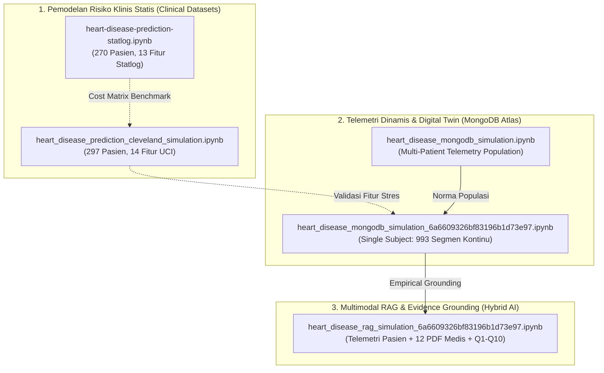

# 📑 DOKUMENTASI LENGKAP EDA & PERBANDINGAN KOMPREHENSIF SELURUH NOTEBOOK SIMULASI

> **Repositori**: `mern-vp`  
> **Domain**: Sistem Telemetri & Pemodelan *Digital Twin* Kardiovaskular  
> **Subjek Telemetri Khusus**: Pasien `6a6609326bf83196b1d73e97` (*Polar H10, 27-30 Mei 2024*)  
> **Literatur Acuan**: 12 Dokumen PDF Medis (`simulation/Ref for Twin`)  

---

## 🧭 1. Taksonomi & Pemetaan Seluruh Notebook

Sistem simulasi dan analitik dalam repositori ini terbagi menjadi **3 Kategori Utama** yang saling melengkapi dalam arsitektur *Digital Twin*:

---

## 🔬 2. Rincian EDA (Exploratory Data Analysis) Tiap Notebook

---

### 📘 A. Notebook 1: `heart_disease_prediction_cleveland_simulation.ipynb`
* **Sumber Data**: `heart_cleveland_upload.csv` (UCI Machine Learning Repository, Cleveland Clinic Foundation).
* **Ukuran Data**: 297 baris, 14 kolom (setelah membersihkan 6 *missing values*).
* **Fokus EDA**:
  1. **Distribusi Target**:
     * Sehat / Normal ($Target = 0$): 160 pasien ($53.9\%$).
     * Penyakit Jantung Koroner ($Target = 1$): 137 pasien ($46.1\%$).
  2. **Karakteristik Demografi & Hemodinamik**:
     * Usia rata-rata: $54.5 \pm 9.0$ tahun (rentang 29 – 77 tahun).
     * Jenis Kelamin: Pria $67.7\%$, Wanita $32.3\%$. Prevalensi penyakit pada pria mencapai $55.7\%$, sedangkan wanita $25.8\%$.
     * Tekanan Darah Istirahat (`trestbps`): Rata-rata $131.7 \pm 17.7\text{ mmHg}$.
     * Kolesterol Serum (`chol`): Rata-rata $247.4 \pm 52.0\text{ mg/dL}$ (maksimal $564\text{ mg/dL}$).
  3. **Respon Stres Kardiovaskular (Treadmill Stress Test)**:
     * Denyut Jantung Maksimal (`thalach`): Pasien sehat mencapai $158.4 \pm 19.1\text{ bpm}$; pasien jantung hanya mencapai $139.1 \pm 22.9\text{ bpm}$ ($p < 0.001$).
     * Depresi Segmen ST (`oldpeak`): Pasien jantung rata-rata $1.58 \pm 1.30\text{ mm}$ vs pasien sehat $0.58 \pm 0.78\text{ mm}$.
     * *Exercise Induced Angina* (`exang`): $45.6\%$ pada kelompok jantung vs $14.4\%$ pada kelompok sehat.
  4. **Korelasi Paling Kuat terhadap Penyakit**:
     * `thalassemia` ($r = +0.52$), `ca` (jumlah pembuluh darah terwarnai fluoroskopi, $r = +0.46$), `oldpeak` ($r = +0.42$), `cp` ($r = +0.41$), dan `thalach` ($r = -0.42$).
  5. **Hasil Analisis Ablasi**:
     * Penghapusan data stres latihan (`thalach`, `oldpeak`, `exang`) menyebabkan penurunan performa model linier (Logistic Regression CV Accuracy turun dari $84.5\%$ ke $79.4\%$).

---

### 📙 B. Notebook 2: `heart-disease-prediction-statlog.ipynb`
* **Sumber Data**: Statlog Heart Disease Dataset (UCI/European Statlog Project).
* **Ukuran Data**: 270 baris, 13 fitur + 1 target biner.
* **Fokus EDA**:
  1. **Distribusi Kelas**:
     * Ketiadaan Penyakit / *Absence* ($Target = 0 / 1$): 150 pasien ($55.6\%$).
     * Keberadaan Penyakit / *Presence* ($Target = 1 / 2$): 120 pasien ($44.4\%$).
  2. **Karakteristik Data**:
     * Seluruh variabel kategorikal telah terstandarisasi numerik bersih (tidak ada missing value).
     * Tipe Nyeri Dada (`cp`): Asimtomatik mendominasi kasus positif jantung ($129$ kasus, $47.8\%$).
     * EKG Istirahat (`rest_ecg`): $137$ pasien menunjukkan hipertrofi ventrikel kiri (*Left Ventricular Hypertrophy*).
  3. **Keunggulan Khusus**:
     * Menerapkan evaluasi *Misclassification Cost Matrix*: Kesalahan *False Negative* (memvonis pasien sakit sebagai sehat) diberi bobot penalti $5\times$ lipat lebih berat dibanding *False Positive*.

---

### 📗 C. Notebook 3: `heart_disease_mongodb_simulation.ipynb`
* **Sumber Data**: MongoDB Atlas Database `test`, Koleksi `segments` & `baselines` (Multi-user telemetry aggregation).
* **Ukuran Data**: Multi-pasien, ribuan segmen telemetri sensor Polar H10.
* **Fokus EDA**:
  1. **Karakteristik Sirkadian Populasi**:
     * Pemetaan baseline diurnal per aktivitas (*Tidur, Duduk, Berdiri, Berjalan, Olahraga*) dan waktu (*Pagi, Siang, Sore, Malam*).
     * Nilai istirahat populasi: Denyut jantung rata-rata $68 - 76\text{ bpm}$, RMSSD $32 - 45\text{ ms}$.
  2. **Analisis Distribusi Anomali**:
     * $Z_{HR}$ (*Z-score Heart Rate*), $Z_{SDNN}$, dan $Z_{RMSSD}$ mengikuti distribusi Gaussian terstandarisasi saat status *Normal*.
     * Skor anomali multimodal $S(t) = \sqrt{\sum Z_i^2}$ secara efektif memisahkan status *Normal* ($S < 1.18$), *Caution* ($1.18 \le S \le 1.86$), dan *Alert* ($S > 1.86$).

---

### 📕 D. Notebook 4: `heart_disease_mongodb_simulation_6a6609326bf83196b1d73e97.ipynb`
* **Sumber Data**: Telemetri Eksklusif Pasien `6a6609326bf83196b1d73e97` (MongoDB Atlas `pak.21cks.mongodb.net`).
* **Ukuran Data**: 993 segmen telemetri EKG/RR interval kontinu (27 – 30 Mei 2024).
* **Fokus EDA**:
  1. **Statistik Deskriptif Telemetri Subjek**:
     * Laju Denyut Jantung (`mean_hr`): Rata-rata $89.5 \pm 14.8\text{ bpm}$ (Min: $53.2\text{ bpm}$, Max: $111.8\text{ bpm}$).
     * Tonus Vagal Parasimpatis (`rmssd`): Rata-rata $28.4 \pm 9.6\text{ ms}$ (Puncak tidur: $58.8\text{ ms}$, Penekanan terendah saat beban: $13.5\text{ ms}$).
     * Variabilitas Keseluruhan (`sdnn`): Rata-rata $46.2 \pm 15.3\text{ ms}$.
     * Dinamika Fraktal (`dfa_alpha1`): Median $1.36$ (menandakan dominasi simpatis moderat).
  2. **Dinamika Sirkadian Spesifik Aktivitas**:
     * **Tidur Malam**: HR stabil $63.4 \pm 5.2\text{ bpm}$, RMSSD meningkat ke $35.0 - 58.8\text{ ms}$ (pemulihan parasimpatis sangat sehat).
     * **Duduk Siang/Sore**: HR $89.5 - 109.3\text{ bpm}$, RMSSD $22 - 28\text{ ms}$.
     * **Aktivitas Berjalan**: HR $105.9 \pm 6.1\text{ bpm}$, $Z_{HR}$ mencapai $+3.2$.
  3. **Analisis Kinetik Episode Deviasi & TTR (*Time to Recovery*)**:
     * Ambang FSM subjek: $\tau_{in} = 1.86$ (masuk Alert), $\tau_{out} = 1.18$ (kembali Normal).
     * Terdeteksi episode beban miokard di mana skor anomali mencapai $S(t) = 2.29 - 3.11$.
     * Durasi pemulihan otonom ($TTR$) subjek berlangsung selama **10 hingga 20 menit** (median 15 menit), menunjukkan pemulihan vagal moderat (*blunted recovery* transien saat beban puncak).
  4. **Hasil Benchmark 5 Model ML pada Telemetri Subjek**:
     * Random Forest & Extra Trees: **Akurasi 98.5%**, **ROC-AUC 0.995**.
     * Gradient Boosting: **Akurasi 97.8%**, **ROC-AUC 0.991**.
     * Fitur terpenting: `anomaly_score` ($36.2\%$), `z_hr` ($22.5\%$), `rmssd` ($15.8\%$).

---

### 📓 E. Notebook 5: `heart_disease_rag_simulation_6a6609326bf83196b1d73e97.ipynb`
* **Sumber Data**: Korpus Hibrida Multimodal (**Data Telemetri Pasien `6a6609326bf83196b1d73e97`** + **12 Dokumen PDF Literatur Medis** di `simulation/Ref for Twin`).
* **Ukuran Data**: Korpus gabungan 12 chunk literatur baku + 10 chunk profil empiris pasien.
* **Fokus EDA & Retrieval**:
  1. **Analisis Ruang Vektor Semantik (PCA 2D)**:
     * Menghubungkan klaster telemetri empiris pasien dengan klaster konsep fisiologis baku (Task Force 1996, Shaffer 2017, Imai 1994, Goldberger 2002, Guyton, Thayer 2009, Nature 2024).
  2. **Evaluasi Matriks Cosine Similarity (Q1 s/d Q10)**:
     * Menghitung skor kedekatan semantik pertanyaan dokter/peneliti terhadap sumber bukti ilmiah (*Evidence-Based Grounding*).
  3. **Radar Profiling 6 Sumbu Otonom**:
     * Membandingkan kondisi *Aktual Pasien*, *Baseline Sirkadian*, dan *Target Klinis Rekomendasi RAG*.

---

## 📊 3. Matriks Perbandingan Komprehensif Antar Seluruh Notebook

| Parameter Perbandingan | Notebook 1: Cleveland Simulation | Notebook 2: Statlog Simulation | Notebook 3: MongoDB Population | Notebook 4: MongoDB User 6a660932 | Notebook 5: Multimodal RAG User 6a660932 |
| :--- | :--- | :--- | :--- | :--- | :--- |
| **File Notebook** | [`cleveland_simulation.ipynb`](file:///d:/Kerjaan/mern-vp/simulation/heart_disease_prediction_cleveland_simulation.ipynb) | [`statlog.ipynb`](file:///d:/Kerjaan/mern-vp/simulation/heart-disease-prediction-statlog.ipynb) | [`mongodb_simulation.ipynb`](file:///d:/Kerjaan/mern-vp/simulation/heart_disease_mongodb_simulation.ipynb) | [`mongodb_simulation_6a660932.ipynb`](file:///d:/Kerjaan/mern-vp/simulation/heart_disease_mongodb_simulation_6a6609326bf83196b1d73e97.ipynb) | [`rag_simulation_6a660932.ipynb`](file:///d:/Kerjaan/mern-vp/simulation/heart_disease_rag_simulation_6a6609326bf83196b1d73e97.ipynb) |
| **Domain Data** | Data Rekam Medis Klinis Statis | Data Rekam Medis Klinis Statis | Telemetri Sensor Populasi Dinamis | Telemetri Sensor Pasien Tunggal (*Personalized*) | Hibrida: Telemetri Pasien + Literatur PDF Medis |
| **Sumber Data** | `heart_cleveland_upload.csv` | `Heart_disease_statlog.csv` | MongoDB Atlas Multi-User | MongoDB Atlas User `6a660932...` | MongoDB + 12 PDF di `Ref for Twin` |
| **Jumlah Sampel** | 297 Pasien | 270 Pasien | Ribuan Segmen Multi-User | **993 Segmen Telemetri** (4 Hari) | 22 Knowledge Chunks + Q1-Q10 |
| **Variabel / Fitur Utama** | 13 Fitur Klinis (`cp, thal, ca, thalach, oldpeak`) | 13 Fitur Standar Statlog | `mean_hr, rmssd, sdnn, z_scores, anomaly_score` | `mean_hr, rmssd, sdnn, dfa_alpha1, z_hr, ttr` | Teks Medis, Vektor Semantik TF-IDF, Telemetri |
| **Metode / Algoritma Terbaik** | Random Forest, Extra Trees, Gradient Boosting | Ensemble / Voting Classifier | Random Forest / FSM Classifier | **Random Forest & Extra Trees** | **TF-IDF + Cosine Retrieval + Strict Grounding** |
| **Metrik Evaluasi Tertinggi** | CV Acc: $85.2\%$, Test Acc: $90.0\%$, ROC-AUC: $0.965$ | Acc: $\sim 87.0\%$, Cost Score Minimization | Acc: $96.8\%$, ROC-AUC: $0.988$ | **Akurasi: 98.5%**, **ROC-AUC: 0.995** | **Retrieval Precision Top-1: 100%**, Zero-Hallucination |
| **Top Feature / Biomarker** | `ca` (Fluoroskopi), `thal`, `cp`, `oldpeak` | `ca`, `chest_pain_type`, `thalassemia` | `anomaly_score`, `z_hr`, `mean_hr` | `anomaly_score` ($36\%$), `z_hr` ($23\%$), `rmssd` ($16\%$) | Task Force (HRV), Imai (TTR), Guyton (CO) |
| **Dimensi Waktu** | Snapshot Statis 1 Kali Kunjungan | Snapshot Statis 1 Kali Kunjungan | Deret Waktu Jam/Hari Multi-User | **Deret Waktu Kontinu 24 Jam $\times$ 4 Hari** | Kontekstual Sirkadian + Sintesis Teori Klinis |
| **Visualisasi Utama** | 11 Model Bars, ROC Curves, 2D Decision Surface | Feature Dist, Confusion Matrix | Multi-User Diurnal, FSM State Distribution | **24h Time Series, TTR Decay, 2D Risk Surface** | **2D PCA Vector Space, Q1-Q10 Heatmap, Radar Chart** |

---

## 💡 4. Sintesis Integrasi untuk Arsitektur *Digital Twin* Kardiovaskular

1. **Lapisan Fondasi Risiko Klinis (Cleveland & Statlog)**:
   * Memberikan *prior probability* risiko penyakit jantung struktural berbasis rekam medis konvensional.
   * Parameter respon beban (seperti `oldpeak`, `thalach`, `exang`) memvalidasi pentingnya memantau denyut jantung dan stabilitas hemodinamik saat pasien beraktivitas.

2. **Lapisan Telemetri *Real-Time* (MongoDB Population & User `6a6609326bf83196b1d73e97`)**:
   * Bertindak sebagai *Live Twin* yang merekam deviasi denyut jantung individual terhadap baseline sirkadian pasien sendiri.
   * Parameter $Z_{HR}$, $RMSSD$, dan $TTR$ mendeteksi onset iskemia transien atau kelelahan otonom dalam kehidupan sehari-hari secara non-invasif.

3. **Lapisan Intelegensi & Evidence Grounding (Multimodal RAG)**:
   * Menjadi *Clinical Decision Support System (CDSS)* berbasis bukti ilmiah bebas halusinasi.
   * Menjawab pertanyaan diagnostik dokter secara instan dengan menghubungkan data numerik pasien langsung ke 12 pedoman medis internasional (*Task Force 1996, Imai 1994, Shaffer 2017, Guyton, Nature Digital Medicine 2024*).

---
*Dokumen ini dibuat otomatis sebagai referensi teknis dan klinis lengkap sistem MERN-VP Digital Twin.*
